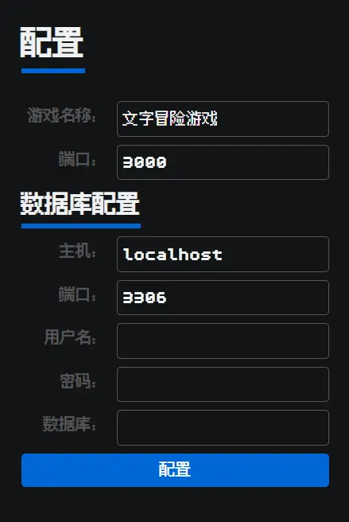

<p align="center">
  <a href="https://adventext.fun">
    
  </a>
</p>

<h1 align="center">Adventext 文字冒险游戏</h1>

文字冒险游戏，一种以文字描述为核心交互方式的游戏，玩家的选择和决策将直接影响游戏的进程和结局。而 Adventext，则是可以用来创作文字冒险游戏的在线编辑器，你可以在这里创作文字冒险游戏，调试运行。然后推送给世界上的任何玩家游玩！

## ✨ 功能

- [x] ✍️ 游戏创作编辑器；
- [x] 🎲 后端游戏引擎；
- [x] 🏆 游戏成就排行榜；

## 🐞 开发调试

``` bash
# 安装后端依赖
npm install

# 安装前端依赖
cd admin && npm install

# 运行前端
npm run admin:dev

```

vscode 按下 F5 运行调试后端或运行 `npm start`


## 🔨 编译发布

1. 编译生成  
``` bash
# 安装后端依赖
npm install

# 安装前端依赖
cd front && npm install

# 回到后端目录
cd ..

# 编译生成运行文件，输出到 dist 目录
npm run build

```

2. 发布部署  
  将 `dist` 目录发布到服务器，运行 `npm ci --prod` 安装依赖，运行 `node index.js` 启动服务。  
  启动服务后，访问 `http://localhost:3000` 即可。可以通过环境变量 `PORT` 修改端口。

3. 配置服务  
  首次访问需配置服务，包含数据库信息，安全配置。  
  

可以通过 PM2 以守护进程方式启动：
  
``` bash
npm install pm2 -g
pm2 start -n adventext node -- index.js
```
