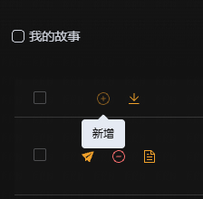
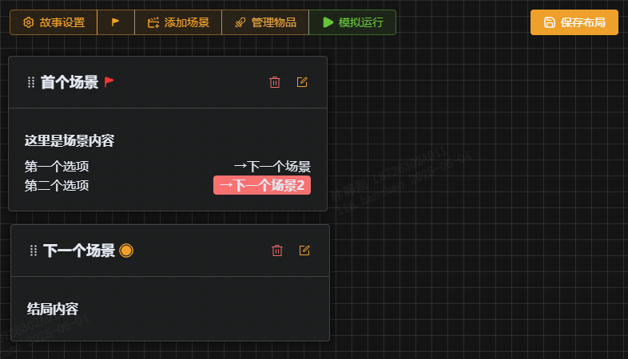
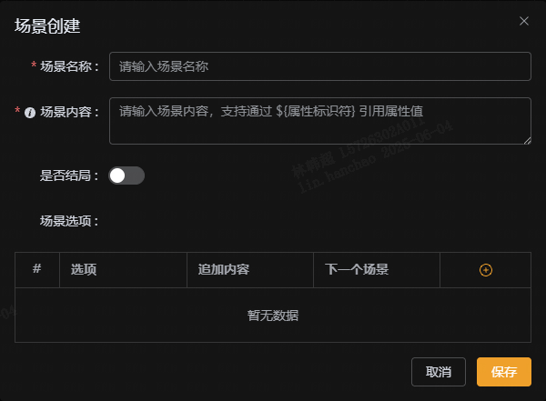
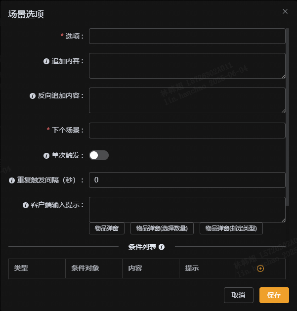

# 快速开始

首先，访问千屿引擎 [https://adventext.fun/admin](https://adventext.fun/admin)，或在你的个人页面点击 ➕ 进入。

## 新建故事

点击页面左上角的 ➕ 按钮，打开新建故事弹窗。

  

输入故事标题`森林与村庄`和描述`森林与村庄之间的故事`，点击【保存】按钮。

## 场景维护

在故事列表中，点击刚创建的故事的名称，进入编辑界面。

  

场景编辑是一个大画板，可以任意拖拽画布，如果要拖拽场景，可以按住场景名称进行拖拽。

### 添加场景

点击工具栏的【添加场景】按钮即可添加一个场景。

  

在场景名称中输入`start`，场景内容输入 `你站在一个分岔路口，左边是黑暗的森林，右边是阳光明媚的小路。`

### 添加选项

点击场景中场景选项的➕，可以添加一个选项。

  

我们来创建两个选项，