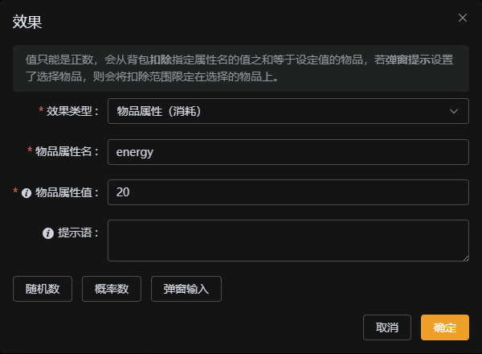
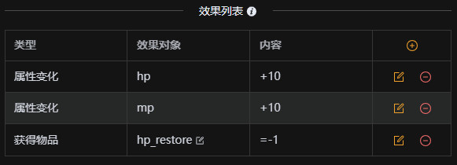

# 选项的效果

当我们需要在玩家触发选项时，给玩家发放物品或改变属性。就需要通过选项的**效果**配置来实现。

## 效果类型 {#type}

效果类型分为四种：

1. **获得物品**:

    这里会出现**物品**和**数量**两个字段，物品可以直接选择。如果有使用**物品弹窗**，使用 `$item` 表示玩家选择的物品。数量则可以是负数，负数则是扣除背包物品，如果数量不足，则会提示玩家。如果想自定义这个错误提示，可以通过条件做前置检查来自定义错误提示。当有使用**物品弹窗(选择数量)**时，可以使用 `$count` 表示玩家选择的数量。

    数量还可以使用 `rand(x,y)` 表示 x~y 的随机数，`percent(x,y)` 表示 x% 的概率获得 y 个，y 省略则表示 1 个，两个函数可嵌套使用，还可以通过 `$物品属性名$` 获取玩家选择物品的属性的值，`#玩家属性名#` 获取玩家的属性的值。注意这样配置如果最后运算非数字将会报错！

    这个可以看看示例故事中 `store` 场景的 `出售物品选项`，就是使用 **物品弹窗(选择数量)** 的方式，让玩家选择要出售的物品，然后扣除物品与发放金币。

      
      

2. **获得成就**：

    如果在维护成就时没有配置成就的获得条件，可以配置此类型来进行成就的颁发。

3. **物品属性(消耗)**：

    这里包含**物品属性名**和**物品属性值**两个字段，值只能是正数，会从背包扣除指定属性名的值之和等于设定值的物品，若**客户端输入值**设置了**物品弹窗**，则会将扣除范围限定在选择的物品上。

    这个可以看看示例故事中的 `iron_shop` 场景的 `翻新武器` 选项。就是通过这个属性扣除了翻新武器所使用的燃料。

      

4. **属性变化**：

    这里包含**属性名**和**属性值**两个字段，对玩家的指定属性进行修改，可以通过输入 `\n` 来表示换行字符串。若前面操作符选择了 `-`、`/`、`*`，则需要保证值的运算结果为数字。属性值可以使用 `$value` 表示弹窗输入，`rand(x,y)` 表示 x~y 的随机数，`percent(x,y)` 表示 x% 的概率增加 y，y 省略则表示 1，两个函数可嵌套使用，还可以通过 `$物品属性名$` 获取玩家选择物品的属性的值，`#玩家属性名#` 获取玩家的属性的值。

    这个可以看看示例故事中的 `右边` 场景中的 `饮用药水` 选项。就是通过修改玩家的属性来实现玩家饮用药水的效果。

      

5. **场景变化**

    如果不希望在选项触发时跳转到固定的场景，而是在满足满足某些条件时跳转到指定的场景，可以配置场景变化，同时配置**触发条件**。就可以实现在满足条件时跳转到指定场景。

6. **函数调用**：

    这个是通过直接执行你配置的函数来实现，函数参数为 `profile`：当前玩家的 Profile 对象，`addItem`：添加物品的函数，`setAttr`：设置属性的函数。

    - profile： 对象的属性包括 `attr`（属性对象 Map）、`inventory`（背包物品数组）、`scene`（当前场景对象）。
    - `addItem` 函数的参数为 `name` （物品名称）和 `count`（数量）。
    - `setAttr` 函数的参数为 `attr` （属性对象），属性对象的 `key` 为属性名，`name` 为属性名称，`value` 为属性值。
    - inventory：当前玩家的背包物品列表，包含属性 `key`（物品标识符）、`name`（物品名称）、`count`（物品数量）、`attr`（物品属性对象 Map）。
    - scene：当前场景对象，包含属性 `name`（场景名称）、`content`（场景内容）、`options`（场景选项数组）。
    - 返回值：`next` 为下一个场景的名称，`message` 为提示信息，`next` 和 `message` 都是可选的。

    这个可以看看示例故事中的 `cave_inside` 场景中的 [`前往右边`](../example/cave) 选项。就是通过函数判断玩家的体力是否足够消耗，当不够消耗时直接传送回起始场景并提示信息。

## 触发条件

如果你想要在满足某些条件后才出发效果，可以在选项的**触发条件**中进行配置。条件的配置与选项的条件完全一致。可以参考[选项的条件](./condition)章节。

## 提示语

所有效果都可以配置提示语，在跳转到下一关时提示，若不设置将使用游戏引擎默认提示，可以使用这些内置变量：

- `$物品属性名$`：获取玩家选择物品的属性的值
- `#玩家属性名#`：获取玩家的属性的值
- `%场景属性名%`：获取场景的属性的值
- `$old`：属性修改前的值
- `$new`：属性修改后的值
- `$item`：选择的物品
- `$value`：输入的值
- `$count`：多物品弹窗所选数量

至此，你就可以掌握所有场景的配置方法了。

## 场景的效果

除了选项可以触发效果，场景也可以分别设置`进入场景效果`与`离开场景效果`，会在进入场景与离开场景时触发。